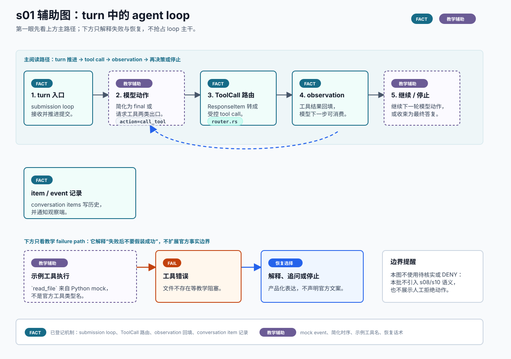

# s01 turn loop 辅助图

边界：`FACT` 只覆盖已登记的 loop 主干机制；mock event、简化时序、示例工具名、失败恢复话术是教学辅助表达。

本页记录 s01 SVG 的输入、机制映射、事实边界和人工检查项。它是可选教学辅助图，不替代本章现有 Mermaid，也不是 OpenAI 官方架构图。



## Source Inputs

输入命令：

```bash
python3 chapters/s01_agent_loop/mock.py --demo --trace-json
python3 chapters/s01_agent_loop/mock.py --demo --path failure --trace-json
```

输入文件：

- `chapters/s01_agent_loop/README.md`
- `chapters/s01_agent_loop/diagram.mmd`
- `chapters/s01_agent_loop/mock.py`
- `docs/diagram-style-guide.md`
- `docs/source-evidence.md`
- `chapters/s04_shell_sandbox_permissions/diagrams/permission-boundary.svg`
- `chapters/s04_shell_sandbox_permissions/diagrams/permission-boundary.md`

## Event / Mechanism Mapping

| 图中表达 | 输入事件或机制 | 图中语义 |
| --- | --- | --- |
| 用户输入 | happy / failure trace `input` | `TEACHING`，用于说明 turn 起点。 |
| loop 入口推进 | `docs/source-evidence.md` 的 s01 `submission_loop` 入口 | `FACT`，只说明 loop 有已登记入口，不展开所有分支。 |
| 模型动作 | happy trace `model` | `TEACHING`，简化为“final 或 tool call”选择。 |
| ToolCall 路由 | s01 已登记 `ResponseItem` 到 `ToolCall` 再到 registry dispatch | `FACT`，不证明具体 handler 业务语义。 |
| 工具执行 | happy trace `tool=read_file` | `TEACHING`，示例工具名来自 mock。 |
| observation 回填 | s01 已登记 tool call 路由与 observation 回写机制 | `FACT`，不声明真实 wire format。 |
| item / event 记录 | s01 已登记 conversation item 写历史、持久化 rollout 与 raw response item 事件 | `FACT`，不覆盖所有事件类型。 |
| 工具错误与恢复选择 | failure trace `tool_error` 和最终 `model` | `FAIL` / `RECOVERY`，仅用于教学 failure path。 |

## Fact Boundary

- `FACT` 只用于已登记证据覆盖的机制点：session loop 提交入口、tool call 转换与路由、observation 回填、conversation item 记录。
- `TEACHING` 用于用户输入节点、模型动作简化、示例工具名、mock trace 编号和继续/停止文案。
- `FAIL` 与 `RECOVERY` 只描述 s01 mock 的 failure path：工具返回文件不存在后，模型解释阻塞或请求用户补充信息。
- 本图不使用 `待核实` 或 `DENY`，因为本批没有引入 s08/s10 未闭环语义，也没有人类拒绝高风险动作的路径。
- 本图不新增官方事实；具体类型名、字段名、事件名和真实停止策略仍以固定 SHA 源码和统一证据索引为准。

## Manual QA

- [x] 图题、节点、说明和图例中文优先。
- [x] SVG 包含 `<title>` 和 `<desc>`，并声明不是 OpenAI 官方架构图。
- [x] Mermaid 仍是本章主机制图，README 只增加可选入口。
- [x] `FACT`、`TEACHING`、`FAIL` 和 `RECOVERY` 均在图中可见。
- [x] mock event、示例工具名和恢复话术均标为教学辅助表达。
- [x] 未新增 `待核实`、`DENY` 或 s08/s10/s12 语义。
- [x] SVG 不依赖外部图片、字体文件、网络或生成工具。
