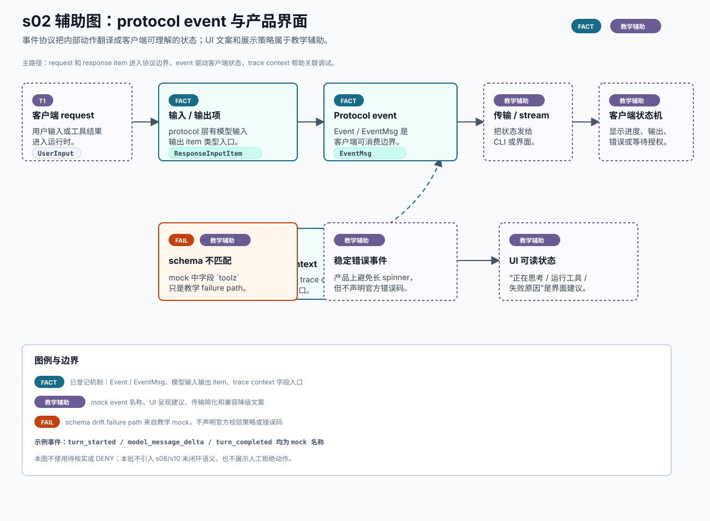

# s02 protocol event 界面辅助图

边界：协议结构入口来自已登记证据；UI 状态、mock event 名称、schema drift 例子和兼容降级策略是教学辅助表达。

本页记录 s02 SVG 的输入、机制映射、事实边界和人工检查项。它是可选教学辅助图，不替代本章现有 Mermaid，也不是 OpenAI 官方架构图。



## Source Inputs

输入命令：

```bash
python3 chapters/s02_protocol_events/mock.py --demo --trace-json
python3 chapters/s02_protocol_events/mock.py --demo --path failure --trace-json
```

输入文件：

- `chapters/s02_protocol_events/README.md`
- `chapters/s02_protocol_events/diagram.mmd`
- `chapters/s02_protocol_events/mock.py`
- `docs/diagram-style-guide.md`
- `docs/source-evidence.md`
- `chapters/s04_shell_sandbox_permissions/diagrams/permission-boundary.svg`
- `chapters/s04_shell_sandbox_permissions/diagrams/permission-boundary.md`

## Event / Mechanism Mapping

| 图中表达 | 输入事件或机制 | 图中语义 |
| --- | --- | --- |
| 客户端 request | happy trace `request` | `TEACHING`，说明用户输入进入协议路径。 |
| 输入 / 输出项 | `docs/source-evidence.md` 的 s02 `ResponseInputItem` / `ResponseItem` 入口 | `FACT`，不逐项声明所有 variant 的 UI 映射。 |
| Protocol event | s02 已登记 `Event` / `EventMsg` 协议边界 | `FACT`，只说明事件包装与枚举入口。 |
| trace context | s02 已登记 trace context 字段入口 | `FACT`，不证明完整 tracing pipeline。 |
| 传输 / stream | `diagram.mmd` 中 transport / stream 简化路径 | `TEACHING`，不声明具体客户端实现。 |
| 客户端状态机 | README 的产品解释 | `TEACHING`，UI 呈现建议不是官方事实。 |
| schema 不匹配 | failure trace `validate` 和字段 `toolz` | `FAIL` / `TEACHING`，只用于教学 failure path。 |
| 稳定错误事件 | failure trace `event` | `TEACHING`，不声明官方错误码或真实 wire format。 |

## Fact Boundary

- `FACT` 只用于已登记证据覆盖的机制点：`Event` / `EventMsg`、模型输入输出 item、trace context 字段入口。
- `TEACHING` 用于 mock event 名称、request/stream 简化、UI 状态建议、schema drift 解释和兼容降级文案。
- `FAIL` 只描述 mock failure path 中的 schema 不匹配示例，不声明官方 Codex 对未知字段一定采用同样校验策略。
- 本图不使用 `待核实` 或 `DENY`，因为本批没有引入 s08/s10 未闭环语义，也没有人工拒绝高风险动作。
- 本图不新增官方事实；真实事件类型、item 类型、字段名和客户端行为仍以固定 SHA 源码和统一证据索引为准。

## Manual QA

- [x] 图题、节点、说明和图例中文优先。
- [x] SVG 包含 `<title>` 和 `<desc>`，并声明不是 OpenAI 官方架构图。
- [x] Mermaid 仍是本章主机制图，README 只增加可选入口。
- [x] 已渲染 PNG 预览并复核：`schema 不匹配` 与 `trace context` 模块不再重叠。
- [x] 模块、文字、chip、箭头和图例之间未出现遮挡或重叠。
- [x] `FACT`、`TEACHING` 和 `FAIL` 均在图中可见。
- [x] UI 呈现建议、mock event 名称和兼容降级文案均标为教学辅助表达。
- [x] 未新增 `待核实`、`DENY` 或 s08/s10/s12 语义。
- [x] SVG 不依赖外部图片、字体文件、网络或生成工具。
