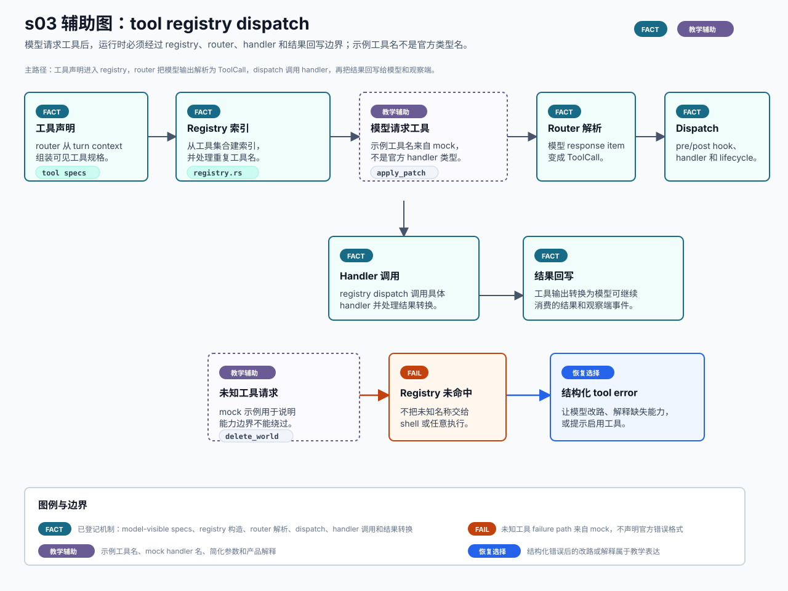

# s03 tool registry dispatch 辅助图

边界：`FACT` 只覆盖已登记的 router、registry、dispatch、handler 和结果回写机制；示例工具名、mock handler 名、简化参数和产品解释是教学辅助表达。

本页记录 s03 SVG 的输入、机制映射、事实边界和人工检查项。它是可选教学辅助图，不替代本章现有 Mermaid，也不是 OpenAI 官方架构图。



## Source Inputs

输入命令：

```bash
python3 chapters/s03_tool_registry_dispatch/mock.py --demo --trace-json
python3 chapters/s03_tool_registry_dispatch/mock.py --demo --path failure --trace-json
```

输入文件：

- `chapters/s03_tool_registry_dispatch/README.md`
- `chapters/s03_tool_registry_dispatch/diagram.mmd`
- `chapters/s03_tool_registry_dispatch/mock.py`
- `docs/diagram-style-guide.md`
- `docs/source-evidence.md`
- `chapters/s04_shell_sandbox_permissions/diagrams/permission-boundary.svg`
- `chapters/s04_shell_sandbox_permissions/diagrams/permission-boundary.md`

## Event / Mechanism Mapping

| 图中表达 | 输入事件或机制 | 图中语义 |
| --- | --- | --- |
| 工具声明 | s03 已登记 router 参数与 model-visible tool specs | `FACT`，不证明所有工具来源加载时机。 |
| Registry 索引 | s03 已登记 registry 构造与重复工具名处理 | `FACT`，不把 log/panic 策略写成稳定 API。 |
| 模型请求工具 | happy trace `model` 和 `tool=apply_patch` | `TEACHING`，示例工具名来自 mock。 |
| Router 解析 | s03 已登记模型 response item 到内部 tool call 的转换边界 | `FACT`，不声明所有 payload kind。 |
| Dispatch / Handler 调用 | s03 已登记 pre/post hook、handler 调用、lifecycle outcome | `FACT`，不覆盖 handler 内部业务语义。 |
| 结果回写 | s03 已登记结果转换与错误回写 | `FACT`，不声明 UI 展示格式。 |
| 未知工具请求 | failure trace `tool=delete_world` | `TEACHING`，用于说明能力边界。 |
| Registry 未命中 | failure trace `router` | `FAIL`，不声明官方错误格式。 |
| 结构化 tool error | failure trace `event` | `RECOVERY`，表示教学上的改路、解释或启用工具选择。 |

## Fact Boundary

- `FACT` 只用于已登记证据覆盖的机制点：model-visible specs、registry 构造、router 解析、dispatch、handler 调用、结果转换与错误回写。
- `TEACHING` 用于 `apply_patch`、`delete_world`、`ApplyPatchHandler`、`known_tools` 等 mock 字段，以及产品解释。
- `FAIL` 与 `RECOVERY` 只描述 s03 mock 的未知工具 failure path，不声明官方 Codex 一定采用相同错误格式或恢复策略。
- 本图不使用 `待核实` 或 `DENY`，因为本批没有引入 s08/s10 未闭环语义，也没有人类拒绝高风险动作。
- 本图不新增官方事实；动态工具、MCP、extension 或 skills 的内容仍按 s10 的 `待核实` 边界处理。

## Manual QA

- [x] 图题、节点、说明和图例中文优先。
- [x] SVG 包含 `<title>` 和 `<desc>`，并声明不是 OpenAI 官方架构图。
- [x] Mermaid 仍是本章主机制图，README 只增加可选入口。
- [x] `FACT`、`TEACHING`、`FAIL` 和 `RECOVERY` 均在图中可见。
- [x] 示例工具名、mock handler 名和简化参数均标为教学辅助表达。
- [x] 未新增 `待核实`、`DENY` 或 s08/s10/s12 状态变化。
- [x] SVG 不依赖外部图片、字体文件、网络或生成工具。
