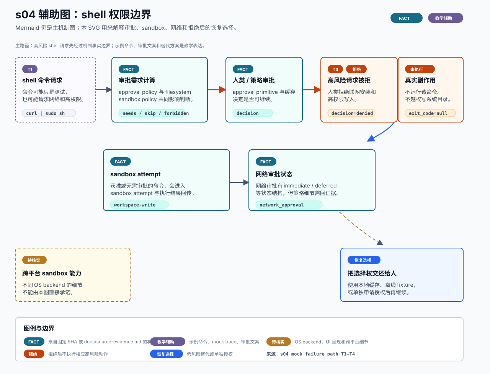

# s04 shell 权限边界辅助图

边界：机制事实来自 s04 已登记证据；示例路径、审批文案和恢复建议是教学辅助表达。

本页记录 s04 SVG 试点的输入、事实边界和人工检查项。它是可选教学辅助图，不替代本章现有 Mermaid，也不是 OpenAI 官方架构图。



## Source Inputs

输入命令：

```bash
python3 chapters/s04_shell_sandbox_permissions/mock.py --demo --path failure --trace-json
```

输入文件：

- `chapters/s04_shell_sandbox_permissions/README.md`
- `chapters/s04_shell_sandbox_permissions/diagram.mmd`
- `chapters/s04_shell_sandbox_permissions/mock.py`
- `docs/source-evidence.md`

## Event Mapping

| 图中编号 | mock event | 图中表达 |
| --- | --- | --- |
| T1 | `tool` | shell 命令请求；示例命令来自教学 mock。 |
| T2 | `policy` | runtime 识别网络与高权限风险，需要升级审批。 |
| T3 | `approval` | 人类拒绝高风险请求。 |
| T4 | `result` | runtime 返回拒绝结果，不执行该高风险命令。 |

## Fact Boundary

- `FACT` 只用于本章已登记证据覆盖的机制点：approval requirement 计算、approval primitive / cache、sandbox attempt、网络审批状态与 deferred flow。
- `TEACHING` 用于示例命令、mock trace 编号、审批文案和低风险替代建议。
- `DENY` 表示教学 failure path 中人类拒绝后不执行高风险命令；不声明官方对任意 shell 字符串的真实分类规则。
- `待核实` 用于 OS sandbox backend 能力差异、具体 UI 审批呈现和跨平台细节。

## Manual QA

- [x] 图题、节点、说明和图例中文优先。
- [x] SVG 包含 `<title>` 和 `<desc>`，并声明不是 OpenAI 官方架构图。
- [x] Mermaid 仍是本章主机制图，README 只增加可选入口。
- [x] `FACT`、`TEACHING`、`DENY`、`RECOVERY` 和 `待核实` 均在图中出现。
- [x] 示例命令和审批文案均标为教学表达。
- [x] 高风险命令被拒后标出“未执行真实副作用”。
- [x] SVG 不依赖外部图片、字体文件、网络或生成工具。
