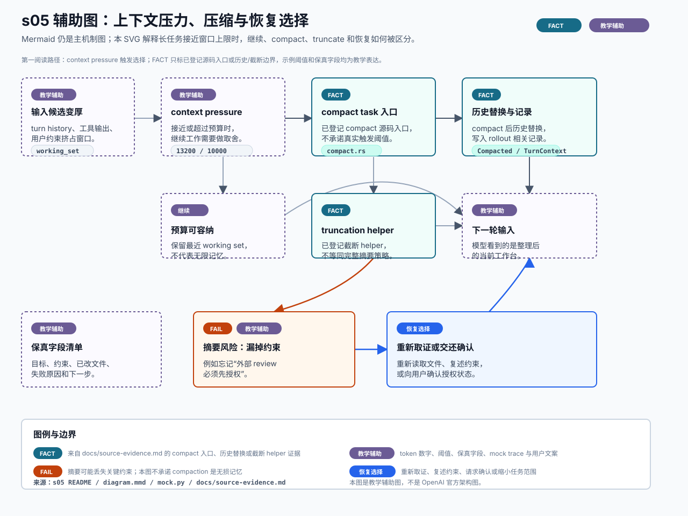

# s05 上下文压力辅助图

边界：`FACT` 只覆盖已登记的 compaction 源码入口、历史替换与截断 helper 证据；context pressure 示例、阈值、保真字段、摘要质量和恢复文案都是教学辅助表达。

本页记录 s05 SVG 的输入、机制映射、事实边界和人工检查项。它是可选教学辅助图，不替代本章现有 Mermaid，也不是 OpenAI 官方架构图。



## Source Inputs

输入命令：

```bash
python3 chapters/s05_context_window_compaction/mock.py --demo --trace-json
python3 chapters/s05_context_window_compaction/mock.py --demo --path failure --trace-json
```

输入文件：

- `chapters/s05_context_window_compaction/README.md`
- `chapters/s05_context_window_compaction/diagram.mmd`
- `chapters/s05_context_window_compaction/mock.py`
- `docs/diagram-style-guide.md`
- `docs/source-evidence.md`
- `chapters/s04_shell_sandbox_permissions/diagrams/permission-boundary.svg`
- `chapters/s04_shell_sandbox_permissions/diagrams/permission-boundary.md`

## Event / Mechanism Mapping

| 图中表达 | 输入事件或机制 | 图中语义 |
| --- | --- | --- |
| 输入候选变厚 | s05 README 与 mock `measure` 前置语境 | `TEACHING`，用于说明 history、工具输出和约束挤占窗口。 |
| context pressure | failure trace `measure` | `TEACHING`，`13200 / 10000` 是 mock 参数，不是真实阈值。 |
| compact task 入口 | `docs/source-evidence.md` 的 s05 `compact 任务入口` | `FACT`，只说明已登记源码入口存在，不声明触发条件。 |
| 历史替换与记录 | `docs/source-evidence.md` 的 s05 `compact 后历史替换与 rollout 记录` | `FACT`，只覆盖已登记行为边界。 |
| truncation helper | `docs/source-evidence.md` 的 s05 `rollout truncation 边界` | `FACT`，但图中明确它不等同完整 compaction 策略。 |
| 保真字段清单 | s05 README 的产品风险解释 | `TEACHING`，字段清单是教学建议。 |
| 摘要风险 | s05 README failure path | `FAIL` / `TEACHING`，说明摘要可能漏掉授权约束。 |
| 恢复选择 | s05 README 产品建议 | `RECOVERY`，表示重新取证、复述约束或请求确认。 |

## Fact Boundary

- `FACT` 只用于已登记证据覆盖的机制点：compact task 入口、compact 后历史替换与 rollout 记录、thread rollout truncation helper。
- `TEACHING` 用于 context pressure 示例、固定 token 数字、阈值、保真字段、摘要质量、mock trace 编号和用户可见文案。
- `FAIL` 只描述教学 failure path：摘要漏掉关键约束后，后续 agent 可能错误行动。
- `RECOVERY` 只描述产品和平台侧的安全恢复选择：重新取证、复述约束、请求确认或缩小任务范围。
- 本图不新增官方事实；真实 compact 触发条件、摘要提示词、remote/v2 字段职责和 token 策略仍以固定 SHA 证据为准。
- 本图不把 rollout/resume 画成 s05 的官方恢复承诺；rollout 相关端到端路径仍按 s08 边界处理。

## Manual QA

- [x] 图题、节点、说明和图例中文优先。
- [x] SVG 包含 `<title>` 和 `<desc>`，并声明不是 OpenAI 官方架构图。
- [x] Mermaid 仍是本章主机制图，README 只增加可选入口。
- [x] 已用 Chrome headless 渲染预览并复核：主路径、风险路径和恢复路径层级清晰。
- [x] 模块、文字、chip、箭头和图例之间未出现遮挡或重叠。
- [x] `FACT`、`TEACHING`、`FAIL` 和 `RECOVERY` 均在图中可见。
- [x] token 数字、阈值、保真字段和摘要质量均标为教学辅助表达。
- [x] SVG 不依赖外部图片、字体文件、网络或生成工具。
