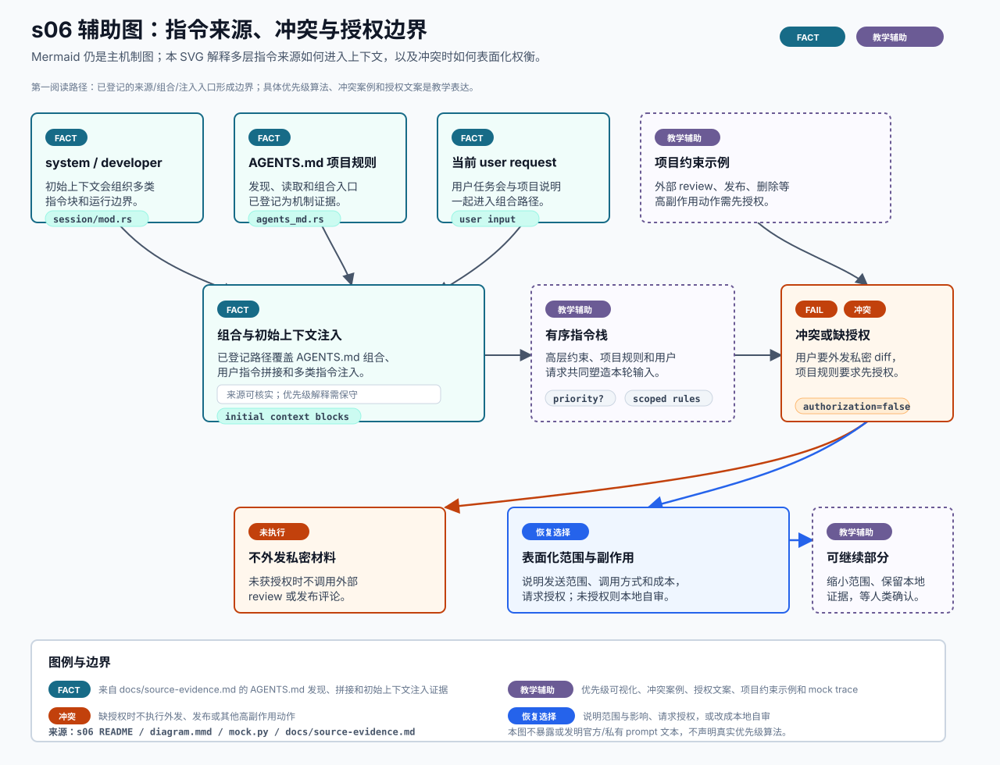

# s06 指令冲突辅助图

边界：`FACT` 只覆盖已登记的 `AGENTS.md` 发现、项目/用户指令拼接和初始上下文注入证据；冲突案例、优先级可视化、授权解释文案和项目约束示例都是教学辅助表达。

本页记录 s06 SVG 的输入、机制映射、事实边界和人工检查项。它是可选教学辅助图，不替代本章现有 Mermaid，也不是 OpenAI 官方架构图。



## Source Inputs

输入命令：

```bash
python3 chapters/s06_prompts_instructions/mock.py --demo --trace-json
python3 chapters/s06_prompts_instructions/mock.py --demo --path failure --trace-json
```

输入文件：

- `chapters/s06_prompts_instructions/README.md`
- `chapters/s06_prompts_instructions/diagram.mmd`
- `chapters/s06_prompts_instructions/mock.py`
- `docs/diagram-style-guide.md`
- `docs/source-evidence.md`
- `chapters/s04_shell_sandbox_permissions/diagrams/permission-boundary.svg`
- `chapters/s04_shell_sandbox_permissions/diagrams/permission-boundary.md`

## Event / Mechanism Mapping

| 图中表达 | 输入事件或机制 | 图中语义 |
| --- | --- | --- |
| system / developer | `docs/source-evidence.md` 的 s06 `初始上下文注入多类指令` | `FACT`，只说明多类指令块存在已登记入口。 |
| `AGENTS.md` 项目规则 | `docs/source-evidence.md` 的 s06 `AGENTS.md 发现与组合` | `FACT`，不证明全部搜索、合并和冲突规则。 |
| 当前 user request | `docs/source-evidence.md` 的 s06 `用户指令与 AGENTS.md 内容拼接` | `FACT`，只覆盖用户指令进入组合路径。 |
| 项目约束示例 | s06 README 与本仓 AGENTS.md 协作规则 | `TEACHING`，用于解释外部 review、发布、删除和全局写入等授权边界。 |
| 组合与初始上下文注入 | s06 已登记机制证据 | `FACT`，不引用不可公开核验的 prompt 文本。 |
| 有序指令栈 | s06 README 的产品解释 | `TEACHING`，优先级可视化不是官方算法。 |
| 冲突或缺授权 | failure trace `user` 与 `decision` | `FAIL` / `TEACHING`，表示教学冲突案例。 |
| 未执行与恢复选择 | s06 README failure path | `DENY` / `RECOVERY`，表示未授权时不外发，并请求人类确认。 |

## Fact Boundary

- `FACT` 只用于已登记证据覆盖的机制点：`AGENTS.md` 发现与组合、用户指令与项目说明拼接、初始上下文注入多类指令。
- `TEACHING` 用于冲突案例、优先级可视化、授权说明文案、项目约束示例、mock trace 编号和产品解释。
- `FAIL` / `DENY` 只描述教学 failure path：用户要求外发私密 diff，但项目规则要求先授权，因此未获授权前不外发。
- `RECOVERY` 只描述安全恢复选择：说明发送范围、调用方式、成本和副作用，请求人类授权；未授权时改用本地自审。
- 本图不新增官方事实，不暴露或发明官方/私有 prompt 文本，也不声明真实优先级算法、所有客户端行为或全部冲突裁决规则。

## Manual QA

- [x] 图题、节点、说明和图例中文优先。
- [x] SVG 包含 `<title>` 和 `<desc>`，并声明不是 OpenAI 官方架构图。
- [x] Mermaid 仍是本章主机制图，README 只增加可选入口。
- [x] 已用 Chrome headless 渲染预览并复核：来源层、组合层、冲突层和恢复层层级清晰。
- [x] 模块、文字、chip、箭头和图例之间未出现遮挡或重叠。
- [x] `FACT`、`TEACHING`、`FAIL` / `DENY` 和 `RECOVERY` 均在图中可见。
- [x] 指令来源可核实，冲突案例、优先级解释和授权文案均标为教学辅助表达。
- [x] SVG 不依赖外部图片、字体文件、网络或生成工具。
