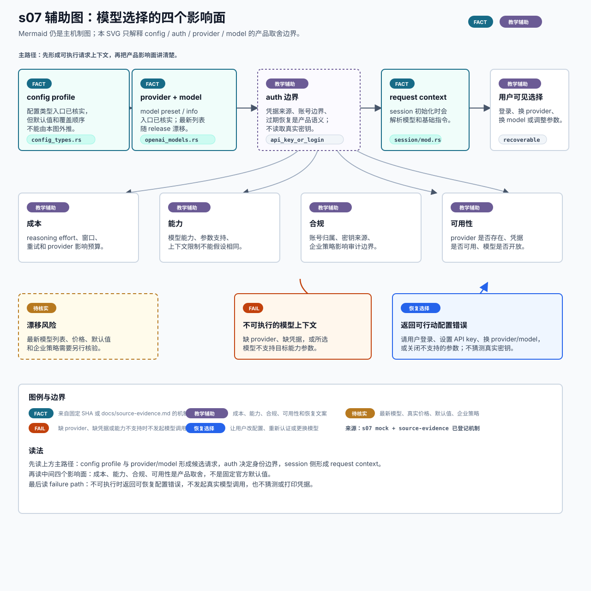

# s07 模型选择影响面辅助图

边界：机制事实来自 s07 已登记证据；成本、能力、合规、可用性和恢复建议是教学辅助表达。

本页记录 s07 SVG 的输入、事实边界和人工检查项。它是可选教学辅助图，不替代本章现有 Mermaid，也不是 OpenAI 官方架构图。



## Source Inputs

输入命令：

```bash
python3 chapters/s07_config_auth_models/mock.py --demo --trace-json
```

输入文件：

- `chapters/s07_config_auth_models/README.md`
- `chapters/s07_config_auth_models/diagram.mmd`
- `chapters/s07_config_auth_models/mock.py`
- `docs/source-evidence.md`

## Event / Mechanism Mapping

| 图中表达 | mock event / mechanism | 说明 |
| --- | --- | --- |
| `config profile` | `config` / config 类型入口 | `FACT` 只表示配置类型入口已核实，不证明默认值或覆盖顺序。 |
| `provider + model` | `config` / model preset 与 model info | `FACT` 只表示模型信息入口已核实，不承诺最新模型列表。 |
| `auth 边界` | `auth` | 教学辅助：说明凭据来源和账号边界会影响产品体验；本图不读取或验证真实凭据。 |
| `request context` | `request` / session 初始化模型选择 | `FACT` 表示 session 初始化会解析模型与相关上下文。 |
| 四个影响面 | 产品解释 | 成本、能力、合规和可用性是 PM 视角的教学拆解。 |
| `不可执行的模型上下文` | `error` | 缺 provider、缺凭据或模型不支持参数时，应返回可恢复配置错误。 |

## Fact Boundary

- `FACT` 只用于 `docs/source-evidence.md` 已登记的 s07 机制点：config 类型入口、model preset / model info、session 初始化时选择模型与 base instructions。
- `TEACHING` / `教学辅助` 用于成本、能力、合规、可用性、auth 产品解释、账号边界、恢复文案和 UI 建议。
- `FAIL` 表示教学 failure path 中请求上下文不可执行；不声明官方对任意 provider、credential 或参数组合的真实判定规则。
- `RECOVERY` 表示教学上的安全下一步：登录、设置 API key、换 provider/model 或关闭不支持的参数。
- `待核实` 用于最新模型列表、真实价格、默认值、企业合规策略和 release 漂移风险。

## Manual QA

- [x] 图题、节点、说明和图例中文优先。
- [x] SVG 包含 `<title>` 和 `<desc>`，并声明不是 OpenAI 官方架构图。
- [x] Mermaid 仍是本章主机制图，README 只增加可选入口。
- [x] `FACT`、`TEACHING`、`FAIL`、`RECOVERY` 和 `待核实` 均在图中解释。
- [x] 没有把最新模型列表、价格、默认值、合规策略或真实凭据状态写成官方事实。
- [x] SVG 不依赖外部图片、字体文件、网络或生成工具。
