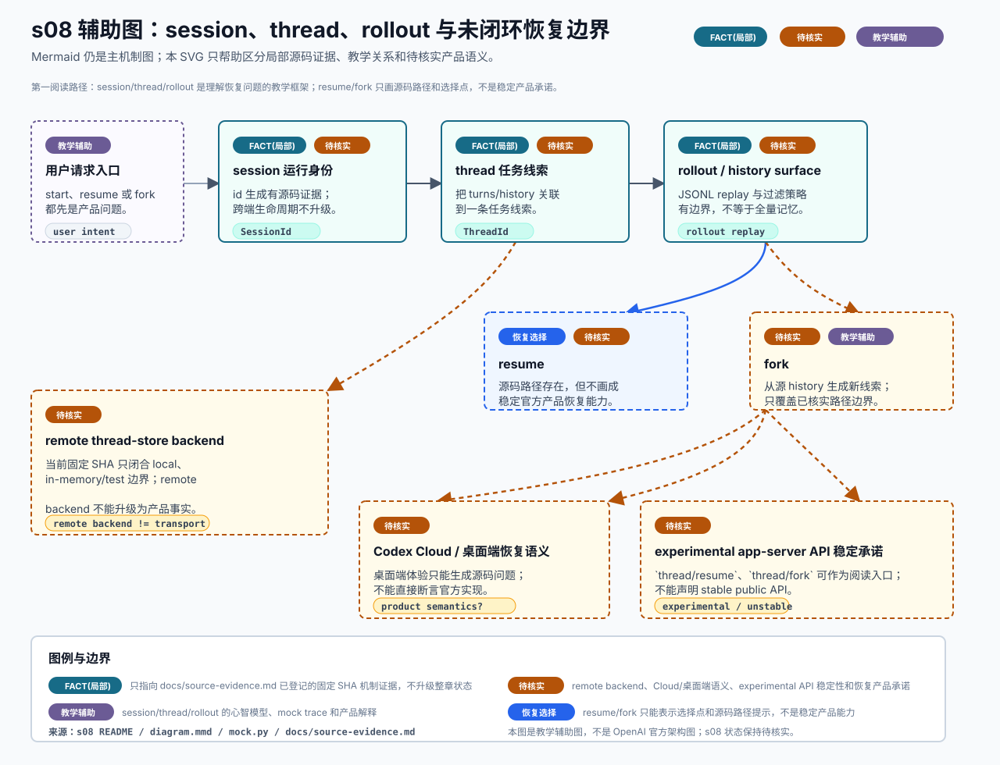

# s08 session/thread/rollout 辅助图

边界：本章状态仍是 `待核实`。本图只辅助理解 session、thread、rollout、resume、fork 的教学关系；不把恢复链路画成 OpenAI 官方稳定产品能力。



## Source Inputs

输入命令：

```bash
python3 chapters/s08_sessions_threads_rollout/mock.py --demo --trace-json
python3 chapters/s08_sessions_threads_rollout/mock.py --demo --path failure --trace-json
```

输入文件：

- `chapters/s08_sessions_threads_rollout/README.md`
- `chapters/s08_sessions_threads_rollout/diagram.mmd`
- `chapters/s08_sessions_threads_rollout/mock.py`
- `docs/diagram-style-guide.md`
- `docs/source-evidence.md`
- `AGENTS.md`

## Event / Mechanism Mapping

| 图中表达 | 输入事件或机制 | 图中语义 |
| --- | --- | --- |
| session 运行身份 | mock `session` 事件与 `SessionId` 已登记证据 | `FACT(局部)` + `待核实`，只说明 id 机制和教学心智入口，不证明跨端生命周期。 |
| thread 任务线索 | mock `thread` 事件、`ThreadId` 与 ThreadStore 已登记证据 | `FACT(局部)` + `待核实`，只说明任务/历史关联边界，不证明跨设备产品语义。 |
| rollout/history surface | mock `persist` 事件与 rollout replay 已登记证据 | `FACT(局部)` + `待核实`，只说明 JSONL/replay 表面和过滤边界，不证明所有事件完整保留。 |
| resume | mock `resume`/failure 事件、app-server cold resume/running rejoin/exec/TUI/debug-client 路径 | `待核实`，只作为源码路径和教学恢复选择，不是官方稳定产品能力。 |
| fork | app-server fork 与 thread rollout truncation 已登记证据 | `待核实`，只覆盖 app-server 路径和 fork/历史截断边界，不证明所有 fork 策略或 UI 语义。 |
| remote thread-store backend | `docs/source-evidence.md` 的 remote store 边界与整体状态判断 | `待核实`，当前固定 SHA 只闭合 local/in-memory/test 边界，不能升级为真实远端后端事实。 |
| Codex Cloud/桌面端恢复语义 | s08 README 的剩余 gap 与 `AGENTS.md` 的 Codex Desktop Lens 规则 | `待核实`，桌面端体验只能生成源码阅读问题，不能直接断言官方实现。 |
| experimental app-server API 稳定承诺 | app-server protocol 中 experimental/unstable 字段与 s08 整体状态判断 | `待核实`，不能声明 `thread/resume` 或 `thread/fork` 是稳定公开 API 承诺。 |

## Fact Boundary

- s08 README 的状态保持 `待核实`。
- `FACT(局部)` 只表示已登记的固定 SHA 机制证据：session/thread id、local/in-memory ThreadStore、rollout replay、app-server resume/fork、exec/TUI/debug-client app-server API 路径等。
- 所有局部证据都不能升级成完整产品语义、跨端恢复承诺或整章状态升级。
- remote thread-store backend、Codex Cloud/桌面端恢复语义、experimental app-server API 稳定承诺在图中都显式标 `待核实`。
- resume/fork 在图中是教学恢复选择和源码路径提示，不是官方稳定恢复产品能力。
- 本图不替代 `diagram.mmd`；Mermaid 仍是 s08 主机制图。
- 本图不新增官方事实；机制级证据仍统一登记在 `docs/source-evidence.md`。

## Manual QA

- [x] 图题、节点、说明和图例中文优先。
- [x] SVG 包含 `<title>` 和 `<desc>`，并声明不是 OpenAI 官方架构图。
- [x] Mermaid 仍是本章主机制图，README 只增加可选入口。
- [x] 已用 Chrome headless 渲染预览并复核：主路径、待核实边界和图例层级清晰。
- [x] 模块、文字、chip、箭头和图例之间未出现遮挡或重叠。
- [x] remote thread-store backend、Codex Cloud/桌面端恢复语义、experimental app-server API 稳定承诺均标为 `待核实`。
- [x] resume/fork 未画成官方稳定产品能力。
- [x] SVG 不依赖外部图片、字体文件、网络或生成工具。
