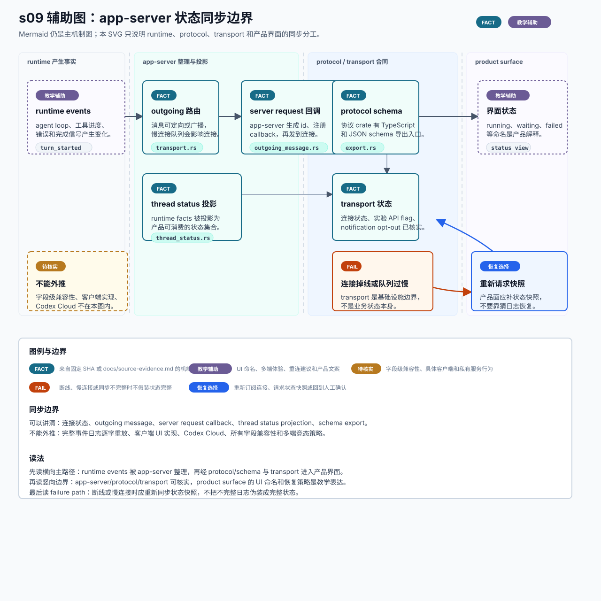

# s09 状态同步边界辅助图

边界：机制事实来自 s09 已登记证据；product surface、UI 命名、多端体验和重连建议是教学辅助表达。

本页记录 s09 SVG 的输入、事实边界和人工检查项。它是可选教学辅助图，不替代本章现有 Mermaid，也不是 OpenAI 官方部署图。



## Source Inputs

输入命令：

```bash
python3 chapters/s09_app_server_transport/mock.py --demo --trace-json
```

输入文件：

- `chapters/s09_app_server_transport/README.md`
- `chapters/s09_app_server_transport/diagram.mmd`
- `chapters/s09_app_server_transport/mock.py`
- `docs/source-evidence.md`

## Event / Mechanism Mapping

| 图中表达 | mock event / mechanism | 说明 |
| --- | --- | --- |
| `runtime events` | `runtime` | 教学辅助：表示运行时产生变化，不把本图画成完整 runtime 架构。 |
| `outgoing 路由` | s09 outgoing envelope 路由证据 | `FACT` 表示 app-server outgoing message 可定向或广播，且慢连接队列有边界。 |
| `server request 回调` | s09 server request/response/callback 证据 | `FACT` 表示 app-server 会为 outbound server request 管理 id 与 callback。 |
| `thread status 投影` | `server` / thread status 投影证据 | `FACT` 表示 runtime facts 会被投影成 thread status。 |
| `protocol schema` | protocol schema export 证据 | `FACT` 表示 app-server-protocol 有 TypeScript / JSON schema 导出入口。 |
| `transport 状态` | `client` / transport 连接状态证据 | `FACT` 表示连接状态、实验 API flag 与 notification opt-out 等入口已核实。 |
| `界面状态` | `client` | 教学辅助：UI 状态命名和多端呈现不是官方实现事实。 |
| `连接掉线或队列过慢` | failure path | 教学 failure path：断线后产品面应请求状态快照，而不是猜日志。 |

## Fact Boundary

- `FACT` 只用于 `docs/source-evidence.md` 已登记的 s09 机制点：transport 连接状态与 outbound 队列、outgoing envelope 路由与慢连接处理、server request callback、thread status 投影和 protocol schema export。
- `TEACHING` / `教学辅助` 用于 product surface、UI 状态命名、多端体验、重连建议、用户可见文案和 mock trace。
- `FAIL` 表示教学 failure path 中连接掉线或慢连接风险；不声明官方客户端一定采用同样恢复策略。
- `RECOVERY` 表示产品上应重新订阅、请求状态快照或回到人工确认。
- `待核实` 用于字段级兼容性、具体客户端实现、完整事件重放、Codex Cloud 和私有服务行为。

## Manual QA

- [x] 图题、节点、说明和图例中文优先。
- [x] SVG 包含 `<title>` 和 `<desc>`，并声明不是 OpenAI 官方部署图。
- [x] Mermaid 仍是本章主机制图，README 只增加可选入口。
- [x] runtime、app-server、protocol/transport 和 product surface 的边界可见。
- [x] `FACT`、`TEACHING`、`FAIL`、`RECOVERY` 和 `待核实` 均在图中解释。
- [x] 没有把 Codex Cloud、具体客户端 UI、多端恢复策略或字段级兼容性写成官方事实。
- [x] SVG 不依赖外部图片、字体文件、网络或生成工具。
