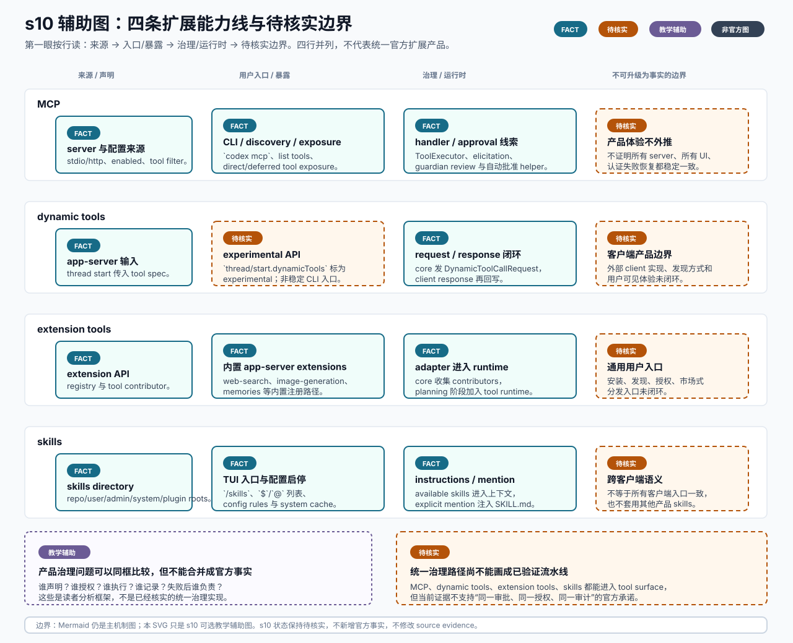

# s10 扩展能力线辅助图

边界：`FACT` 只覆盖已登记的 s10 局部机制证据；四条能力线的并列比较、产品治理问题和读者提示是教学辅助表达。s10 章节状态保持 `待核实`。

本页记录 s10 SVG 的输入、机制映射、事实边界和人工检查项。它是可选教学辅助图，不替代本章现有 Mermaid，也不是 OpenAI 官方架构图。



## Source Inputs

输入命令：

```bash
python3 chapters/s10_extensions_mcp_skills/mock.py --demo --trace-json
python3 chapters/s10_extensions_mcp_skills/mock.py --demo --path failure --trace-json
```

输入文件：

- `chapters/s10_extensions_mcp_skills/README.md`
- `chapters/s10_extensions_mcp_skills/diagram.mmd`
- `chapters/s10_extensions_mcp_skills/mock.py`
- `docs/diagram-style-guide.md`
- `docs/source-evidence.md`
- `openspec/specs/s10-extensions-mcp-skills-verification/spec.md`
- `openspec/specs/s10-extensions-mcp-skills-deep-verification/spec.md`

## Event / Mechanism Mapping

| 图中表达 | 输入事件或机制 | 图中语义 |
| --- | --- | --- |
| MCP 来源、CLI/config、discovery/exposure、handler/approval | `docs/source-evidence.md` 的 s10 MCP entries | `FACT`，只覆盖已登记的 MCP 用户入口、配置字段、tool discovery/exposure、handler、elicitation 和 approval 线索。 |
| MCP 产品体验不外推 | s10 README 与 evidence unresolved questions | `待核实`，不证明所有 MCP server、所有 UI、认证失败恢复都稳定一致。 |
| dynamic tools app-server 输入 | s10 evidence 的 `thread/start.dynamicTools` 与 session configuration | `FACT`，只说明 app-server/protocol/runtime 路径存在。 |
| dynamic tools experimental API | app-server README/protocol 已登记证据 | `待核实`，明确 experimental，不能画成稳定 CLI 用户创建工具入口。 |
| dynamic tools request/response 闭环 | dynamic tool request/response event flow 证据 | `FACT`，只覆盖 core 与 app-server/client response 的机制链路。 |
| dynamic tools 客户端产品边界 | s10 README 与 deep verification spec | `待核实`，外部 client 实现、发现方式和用户可见体验未闭环。 |
| extension API、内置 app-server extensions、adapter 进入 runtime | s10 extension evidence entries | `FACT`，只覆盖 registry、tool contributor、内置 extensions 和 core adapter 路径。 |
| 通用 extension 用户入口 | s10 README、deep verification spec、source evidence unresolved questions | `待核实`，安装、发现、授权、市场式分发入口未闭环。 |
| skills directory、TUI 入口、配置启停、instructions、explicit mention | s10 skills evidence entries | `FACT`，只覆盖目标 commit 下已登记的 TUI、loader/config、system cache、instruction rendering 和 mention injection。 |
| skills 跨客户端语义 | s10 README unresolved questions | `待核实`，不证明所有客户端 UI 行为一致，也不套用 Claude Code skills 或 Codex 桌面端插件体验。 |
| 统一治理路径 | s10 README 与 evidence 的整体能力语义 pending entry | `待核实`，当前证据不支持四条能力线共享同一审批、授权和审计路径。 |
| 产品治理问题 | s10 README 的平台设计解释 | `教学辅助`，用于提示 PM 从声明、授权、执行、记录和失败责任审视能力线。 |

## Fact Boundary

- `FACT` 只用于 `docs/source-evidence.md` 已登记的 s10 局部机制点，不能自动升级章节状态。
- `待核实` 显式覆盖 dynamic tools experimental API 稳定性、通用 extension 用户安装/发现/授权入口、统一治理路径和 skills 跨客户端语义。
- `教学辅助` 用于四条能力线的并列表达、产品治理框架、mock trace 和读者提示。
- 本图不把 MCP、dynamic tools、extension tools 和 skills 合并成统一官方扩展产品承诺。
- 本图不新增官方事实，不修改 `docs/source-evidence.md`，也不改变 s10 的 `待核实` 状态。

## Manual QA

- [x] 图题、节点、说明和图例中文优先。
- [x] SVG 包含 `<title>` 和 `<desc>`，并声明不是 OpenAI 官方架构图。
- [x] Mermaid 仍是本章主机制图，README 只增加可选入口。
- [x] 四条能力线保持视觉分离，未画成统一官方扩展产品。
- [x] dynamic tools experimental、通用 extension 用户入口、统一治理路径均显式标 `待核实`。
- [x] `FACT`、`待核实` 和 `教学辅助` 均在图中可见。
- [x] SVG 不依赖外部图片、字体文件、网络或生成工具。
