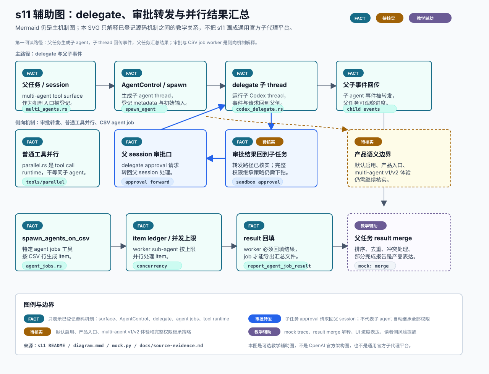

# s11 subagents 与并行 job 辅助图

边界：`FACT` 只覆盖已登记的 s11 源码机制；默认启用、产品入口、multi-agent v1/v2 体验和完整权限继承策略仍需核实。

本页记录 s11 SVG 的输入、机制映射、事实边界和人工检查项。它是可选教学辅助图，不替代本章现有 Mermaid，也不是 OpenAI 官方架构图或通用官方子代理平台。



## Source Inputs

输入命令：

```bash
python3 chapters/s11_subagents_parallel_jobs/mock.py --demo --trace-json
python3 chapters/s11_subagents_parallel_jobs/mock.py --demo --path failure --trace-json
```

输入文件：

- `AGENTS.md`
- `docs/diagram-style-guide.md`
- `chapters/s11_subagents_parallel_jobs/README.md`
- `chapters/s11_subagents_parallel_jobs/diagram.mmd`
- `chapters/s11_subagents_parallel_jobs/mock.py`
- `docs/source-evidence.md`
- `openspec/specs/review-scope-clarifications/spec.md`
- `openspec/specs/pending-chapter-verification/spec.md`

## Event / Mechanism Mapping

| 图中表达 | 输入事件或机制 | 图中语义 |
| --- | --- | --- |
| 父任务 / session | `docs/source-evidence.md` 的 s11 `multi-agent tool surface` | `FACT`，只说明已登记源码机制存在，不说明默认暴露。 |
| `AgentControl / spawn` | s11 `spawn_agent tool spec` 与 `AgentControl` 生成、登记子 agent | `FACT`，只覆盖已登记源码机制。 |
| delegate 子 thread | s11 `delegate subagent 事件与审批转发` | `FACT`，表示子 Codex thread 和事件转发机制。 |
| 父子事件回传 | s11 `codex_delegate.rs` 事件转发证据 | `FACT`，不扩展为通用 UI 体验承诺。 |
| 父 session 审批口 | s11 `codex_delegate.rs` approval 请求路由回父 session | `FACT`，只覆盖审批转发路径。 |
| 审批结果回到子任务 | 同一 delegate 审批转发机制 | `FACT` + `待核实`，完整权限继承策略仍需继续核实。 |
| 普通工具并行 | s11 `tool call 并行运行时` | `FACT`，并显式说明它不等同子 agent 并行。 |
| `spawn_agents_on_csv` | s11 `agent job CSV worker 并发` | `FACT`，表示特定工具机制，不等同通用批处理 API。 |
| item ledger / 并发上限 | s11 agent jobs item / worker 机制 | `FACT`，只覆盖 CSV job worker 行为。 |
| result 回填 | `report_agent_job_result` 回填结果与导出 | `FACT`，只覆盖已登记 job result 行为。 |
| 父任务 result merge | s11 README 与 mock `join` / `merge` 事件 | `TEACHING`，排序、去重、冲突处理和部分完成报告是教学表达。 |
| 产品语义边界 | s11 README 与 OpenSpec scope clarification | `待核实`，默认启用、产品入口、multi-agent v1/v2 体验仍需核实。 |

## Fact Boundary

- `FACT` 只用于已登记证据覆盖的机制点：multi-agent handler / `spawn_agent` surface、`AgentControl` 生成与登记子 agent、delegate 事件与审批转发、CSV agent job worker / result 回填、普通 tool call 并行运行时。
- `待核实` 明确覆盖默认启用条件、产品入口、multi-agent v1/v2 体验差异，以及完整权限继承策略。
- `TEACHING` 用于 mock trace、result merge 的产品解释、进度 UI、冲突处理策略、部分完成报告和读者侧风险提醒。
- 本图不新增官方事实，不声明 s11 是通用官方子代理平台，不声明 agent jobs 是通用批处理 API。
- 本图明确区分 `tools/parallel.rs`：它是普通 tool call 并行运行时，不等同于子 agent 并行。
- 本图不改变 s11 章节状态；s11 已核实范围仍限于已登记源码机制。

## Manual QA

- [x] 图题、节点、说明和图例中文优先。
- [x] SVG 包含 `<title>` 和 `<desc>`，并声明不是 OpenAI 官方架构图或通用官方子代理平台。
- [x] Mermaid 仍是本章主机制图，README 只增加可选入口。
- [x] `FACT`、`待核实` 和 `TEACHING` 均在图中可见。
- [x] 默认启用、产品入口、multi-agent v1/v2 体验和完整权限继承策略均标为 `待核实`。
- [x] `tools/parallel.rs` 被标为普通 tool call runtime，不画成子 agent 并行。
- [x] result merge、mock trace 和产品进度表达均标为教学辅助表达。
- [x] SVG 不依赖外部图片、字体文件、网络或生成工具。
