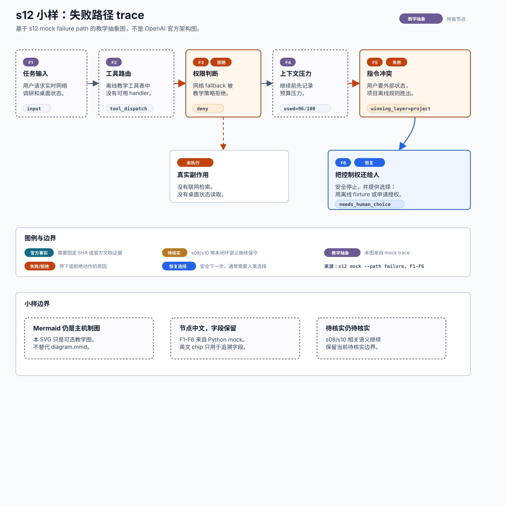

# s12 失败路径插图小样

状态：教学抽象

本页记录 s12 failure trace pilot 的输入、边界和人工检查项。它是中文为主的教学插图小样，不是 OpenAI 官方架构图，不替代本章现有 Mermaid。



## 为什么上一版偏英文

上一版小样不是事实边界错误，而是展示层设计偏向工程 trace：

- mock 的 event kind 和 detail 字段本身是英文，例如 `tool_dispatch`、`permission_decision`、`decision_reason`。
- SVG 直接把英文 event kind 用作节点标题，混淆了“给机器追溯的字段”和“给人理解的教学表达”。
- 图例沿用了 `FACT`、`TEACHING`、`RECOVERY` 等英文 badge，方便 code review，但不够贴合中文读者。
- 图题和边界说明也用了英文模板，导致首屏更像工程调试图，而不是中文教学插图。

改写原则：标题、节点、说明、图例和边界说明中文优先；英文只保留在小号字段 chip 中，用来追溯 mock trace。

## Source Inputs

输入命令：

```bash
python3 chapters/s12_comprehensive_architecture/mock.py --demo --path failure --trace-json
```

输入文件：

- `chapters/s12_comprehensive_architecture/mock.py`
- `src/learn_codex_mock/runtime.py`
- `chapters/s12_comprehensive_architecture/diagram.mmd`
- `chapters/s12_comprehensive_architecture/README.md`

## Event / Mechanism Mapping

| 图中编号 | mock event | 图中表达 |
| --- | --- | --- |
| F1 | `input` | 任务输入：用户请求实时网络调研和桌面状态。 |
| F2 | `tool_dispatch` | 工具路由：离线教学工具表中没有可用 handler。 |
| F3 | `permission` | 权限判断：网络 fallback 被教学策略拒绝。 |
| F4 | `context` | 上下文压力：继续前记录预算压力。 |
| F5 | `instruction_conflict` | 指令冲突：用户要外部状态，但项目离线规则胜出。 |
| F6 | `recovery` | 恢复选择：runtime 安全停止，把离线 fixture 或授权路径交还给人类选择。 |

## Fact Boundary

- 整张图标为“教学抽象”：它来自 s12 Python mock，不代表 OpenAI Codex 官方实现、Codex 桌面端实现、生产部署或真实权限 UI。
- 图例保留“官方事实”，但本 pilot 没有把任何 trace 节点标成官方事实。
- 图例保留 `待核实`，提醒 s08/s10 相关 session/thread/rollout、MCP、skills 和 extensions 语义不能被图形表达顺手升级。
- “未执行”块只表达教学 mock 的副作用边界：不会调用真实网络、真实桌面状态或 OpenAI API。

## Manual QA

- [x] 图题和副标题中文优先，并写明不是 OpenAI 官方架构图。
- [x] F1-F6 与 s12 failure trace 顺序一致。
- [x] 失败 / 拒绝节点有红色标记和中文 badge。
- [x] 恢复选择节点有蓝色标记，并明确需要人类选择。
- [x] “官方事实”、“待核实”、“教学抽象”、“失败/拒绝”、“恢复选择”均出现在图例中。
- [x] 英文 event kind 和字段只作为小号追溯标签，不作为主标题。
- [x] SVG 不依赖外部图片、字体文件、网络或生成工具。
- [x] 已用本机 Quick Look 渲染临时 PNG 预览，检查无明显裁切或文字溢出。
